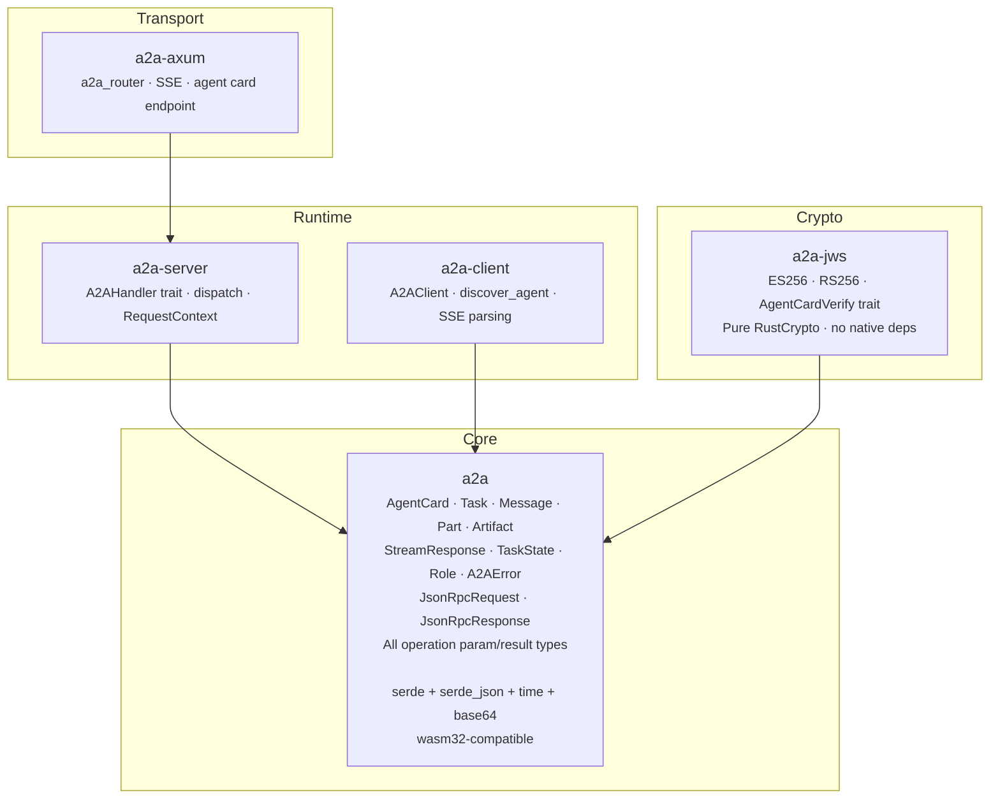

# Arai A2A *for Rust*

Rust implementation of the [Agent-to-Agent (A2A) protocol](https://a2a-protocol.org/), the open standard for inter-agent communication under the [Linux Foundation](https://www.linuxfoundation.org/).

Spec-compliant. Runtime-agnostic. Modular.

## Why this workspace

The A2A protocol defines how autonomous agents discover each other and exchange work over JSON-RPC 2.0 with SSE streaming. This workspace brings the protocol to Rust with a design shaped by the language's strengths:

- **Zero-cost layering**—core types depend only on serde. No async runtime, no HTTP framework, no TLS stack. Pick the crates you need; leave the rest.
- **Compile-time protocol safety**—exhaustive pattern matching on task states, stream events, and content types. `#[non_exhaustive]` enums and `#[serde(other)]` on `TaskState::Unknown` for forward-compatible deserialisation as the spec evolves.
- **Native async traits**—the `A2AHandler` trait uses stable async fn in traits. No hidden allocations in the handler path.
- **Full v1.0 spec coverage**—all 11 JSON-RPC methods, agent card discovery, SSE streaming, push notification CRUD, JWS signature verification, and the complete security scheme model.
- **Property-tested serialisation**—proptest generators verify round-trip fidelity for every core type, catching edge cases that handwritten tests miss.
- **Wasm-ready core**—the `a2a` crate compiles to `wasm32-unknown-unknown` with no feature flags or conditional compilation.

## Architecture



Each box is an independent crate. Depend on only what you need—a wasm library that just needs the types pulls in `a2a` alone.

## Quick start

Add the crates you need:

```toml
# Core types only (shared libraries, wasm, custom transports)
[dependencies]
a2a = "0.0.0"

# Building an agent with axum
[dependencies]
a2a = "0.0.0"
a2a-server = "0.0.0"
a2a-axum = "0.0.0"

# Calling remote agents
[dependencies]
a2a = "0.0.0"
a2a-client = "0.0.0"

# JWS agent card verification
[dependencies]
a2a = "0.0.0"
a2a-jws = "0.0.0"
```

### Implementing an agent

```rust
use a2a::{A2AError, Message, Role, SendMessageParams, SendMessageResult};
use a2a_server::{A2AHandler, RequestContext};

struct EchoAgent;

impl A2AHandler for EchoAgent {
    fn message_send(
        &self,
        _context: &RequestContext,
        params: SendMessageParams,
    ) -> impl std::future::Future<Output = Result<SendMessageResult, A2AError>> + Send + '_ {
        async move {
            let reply = Message::new("reply-1", Role::Agent, params.message.parts);
            Ok(SendMessageResult::Message(reply))
        }
    }
}
```

### Serving with axum

```rust
use a2a::{AgentCapabilities, AgentCard, AgentCardRequired, AgentInterface};
use a2a_axum::a2a_router;

let card = AgentCard::new(AgentCardRequired {
    name: "Echo Agent".into(),
    description: "Echoes messages back to the caller".into(),
    supported_interfaces: vec![
        AgentInterface::new("https://localhost:3000/", "JSONRPC", "1.0"),
    ],
    version: "1.0.0".into(),
    capabilities: AgentCapabilities::default(),
    skills: vec![],
    default_input_modes: vec!["text/plain".into()],
    default_output_modes: vec!["text/plain".into()],
});

let router = a2a_router(EchoAgent, card);
let listener = tokio::net::TcpListener::bind("0.0.0.0:3000").await.unwrap();
axum::serve(listener, router).await.unwrap();
```

### Calling a remote agent

```rust
use a2a::{Message, Role, SendMessageParams};
use a2a_client::{A2AClient, discover_agent};

let http = reqwest::Client::new();
let card = discover_agent(&http, "https://agent.example.com").await?;
let client = A2AClient::from_agent_card(http, &card)?;

let params = SendMessageParams::new(
    Message::text("msg-1", Role::User, "Hello, agent!"),
);
let result = client.message_send(&params).await?;
```

## Crates

| Crate | What it provides |
|-------|-----------------|
| `a2a` | Protocol types, JSON-RPC envelopes, operation params/results. No runtime deps beyond serde. |
| `a2a-server` | `A2AHandler` trait, `dispatch()`, `RequestContext`. Adds `futures-core`. |
| `a2a-client` | `A2AClient`, `discover_agent()`, SSE stream parsing. Adds `reqwest`. |
| `a2a-axum` | `a2a_router()`, SSE bridge, `/.well-known/agent.json` endpoint. Adds `axum`, `tokio`. |
| `a2a-jws` | JWS signature verification (ES256, RS256), `AgentCardVerify` trait. Adds `RustCrypto`. |

## Protocol coverage

All operations defined in the [A2A v1.0 specification](https://a2a-protocol.org/):

| Method | Client | Server | Description |
|--------|--------|--------|-------------|
| `SendMessage` | yes | yes | Send a message, get a Task or reply |
| `SendStreamingMessage` | yes | yes | Send with SSE streaming response |
| `GetTask` | yes | yes | Retrieve a task by ID |
| `ListTasks` | yes | yes | List tasks with filtering |
| `CancelTask` | yes | yes | Cancel a running task |
| `SubscribeToTask` | yes | yes | Reconnect to a task's SSE stream |
| `CreateTaskPushNotificationConfig` | yes | yes | Create/update webhook config |
| `GetTaskPushNotificationConfig` | yes | yes | Retrieve webhook config |
| `ListTaskPushNotificationConfigs` | yes | yes | List all webhook configs for a task |
| `DeleteTaskPushNotificationConfig` | yes | yes | Remove a webhook config |
| `GetExtendedAgentCard` | yes | yes | Fetch authenticated agent card |

Agent discovery (`GET /.well-known/agent.json`) is supported on both client (`discover_agent()`) and server (`a2a_router()`) sides.

## Examples

The `axum/examples/` directory contains runnable agents:

| Example | Command | What it shows |
|---------|---------|---------------|
| `echo_agent` | `cargo run -p a2a-axum --example echo_agent` | Minimal stateless agent, immediate Message response |
| `streaming_agent` | `cargo run -p a2a-axum --example streaming_agent` | SSE streaming with progress updates and artifact delivery |
| `stateful_agent` | `cargo run -p a2a-axum --example stateful_agent` | In-memory task store, tasks/get, tasks/cancel, input-required |

Each example listens on a different port (3000, 3001, 3002) so they can run simultaneously. Test with `curl` commands shown in the example file headers.

## Design decisions

**Typed timestamps.** Timestamps are `time::OffsetDateTime`, normalised to UTC on construction to match proto3 `google.protobuf.Timestamp` semantics. Wire format is RFC 3339.

**Forward-compatible task states.** `TaskState::Unknown(String)` with `#[serde(other)]` deserialises any unrecognised state string without failing. A client built against one spec version handles tasks from agents running a newer version. The original wire string is preserved through round-trips.

**Non-exhaustive public types.** `A2AError`, `VerificationError`, and key enums are marked `#[non_exhaustive]` so fields and variants can be added in minor versions without breaking downstream code.

**Extension trait for JWS.** Agent card signature verification lives in the `a2a-jws` crate as an extension trait (`AgentCardVerify`). Import the trait and call `card.verify_signatures(keys)`. This keeps the core `a2a` crate free of cryptographic dependencies.

## Minimum supported Rust version

Edition 2024. Requires Rust 1.85+ for native async fn in trait support and edition 2024 features.

## Contributing

Contributions are welcome. The project tracks the [A2A specification](https://a2a-protocol.org/) and uses the [Python SDK](https://github.com/a2aproject/a2a-python) as the reference for JSON wire format.

To run the full test suite:

```sh
cargo test --workspace
```

## License

Copyright [Responsible Engineering Ab](https://responsible.engineering), governed by [Omnifi Foundation](https://omnifi.foundation).

[MPL-2.0](LICENSE.txt)
